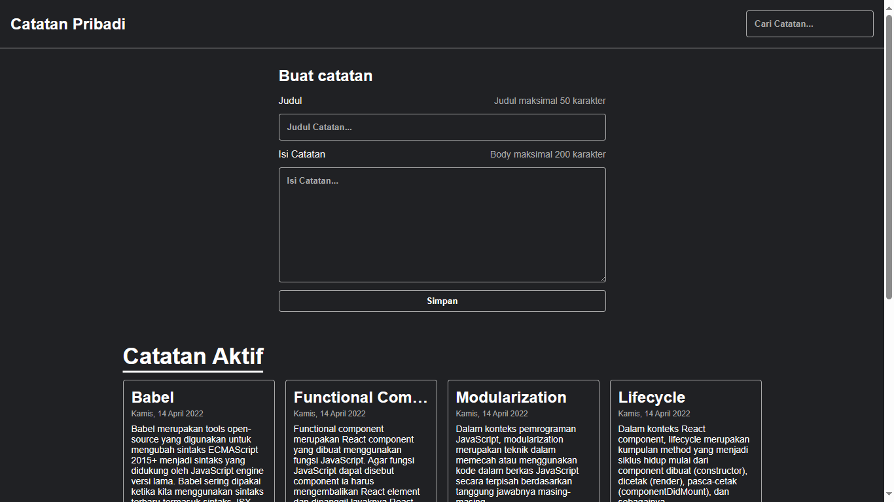

# Belajar Membuat Aplikasi Web dengan React - Dicoding

Kelas Belajar Membuat Aplikasi Web dengan Reac | Alur Belajar React Developer | Dicoding

Materi yang dipelajari dikelas ini:

- **Pengenalan React** : Berkenalan dengan React, mengetahui alasan mempelajari React, dan mengenal ekosistem yang ada di React.
- **Konsep Dasar React** : Belajar tentang konsep dasar React seperti composition, declarative code, unidirectional data flow, dan menyadari bahwa React hanyalah JavaScript.
- **React UI Component** : Belajar tentang membangun UI di React seperti mengenal element dan component. Serta, belajar juga konsep component properti yang membuat UI aplikasi bersifat reusable.
- **Stateful Component** : Belajar tentang class component, menggunakan state di dalam component, memahami dan mempraktikkan controlled component.

## Submission

Pada submission kelas ini, saya membuat Aplikasi Web Catatan Pribadi sederhana dengan menggunakan template UI yang disediakan oleh Dicoding dan menambahkan fungsi Create, Read, Update (Pindahkan Ke Arsip atau Catatan Aktif), dan Delete. 

  
<a href="https://mypersonal-notes.vercel.app/" target="_blank">Demo</a>

Create with ❤ | Hizkia Reppi
